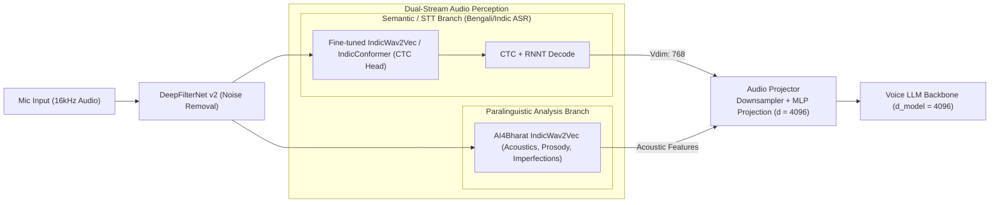

# Samvyas: Agent Instructions & Engineering Handbook

Welcome to **Samvyas** — a research and production framework for **Multimodal Multilingual Voice Intelligence** (specializing in Bengali, Hindi, and English).

All AI coding assistants and pair programmers operating in this repository must strictly adhere to the guidelines and architecture defined in this document.

---

## 1. Architectural Source of Truth

The end-to-end perception design is defined in [`public/stt.png`](./public/stt.png):



---

## 2. Core Agent Principles

1. **Plan Before Implementation**:
   - For any multi-file feature or architectural change, write out the plan in `plan.md` and confirm alignment before writing code.
2. **Modular Decoupling**:
   - Every block in the architecture diagram must be an isolated, testable PyTorch module with explicit interfaces.
   - Never tightly couple the denoiser, audio encoders, projector, and LLM backbone into a monolithic file.
3. **Strict Audio & Tensor Standards**:
   - **Sampling Rate:** All internal processing assumes **16,000 Hz (16 kHz)** mono audio.
   - **Amplitude Range:** Float32 in range `[-1.0, 1.0]`.
   - **Tensor Shape Standards:**
     - Raw Audio: `(B, T)` or `(B, 1, T)`
     - Semantic Latents: `(B, T_frames, 768)`
     - Projector Output: `(B, T_downsampled, 4096)`
4. **Hardware Awareness & Resource Restraints**:
   - Local development GPU: **NVIDIA GeForce RTX 2050 (4 GB VRAM)**.
   - Heavy encoders must support evaluation mode (`eval()`), inference freezing (`torch.no_grad()`), and mixed precision (`torch.amp.autocast('cuda')`).
   - Offload or clear GPU memory (`torch.cuda.empty_cache()`) appropriately when running multiple models.
   - Training scale target: **Kaggle GPU/TPU environments**.
5. **Git Safety & Repository Cleanliness**:
   - **NEVER** stage or commit large binary weights (`.ckpt`, `.pt`, `.bin`, `.nemo`, `.safetensors`, `.onnx` > 100MB).
   - Use Hugging Face Hub cache (`hf_hub_download`) or external artifact download scripts rather than committing weights.
   - Never commit `__pycache__`, `.venv`, or temporary experiment artifacts.
6. **Testing & Verification Rigor**:
   - Every new module must come with a unit test in `tests/` verifying forward passes, output tensor shapes, and gradient flow (when trainable).

---

## 3. Directory Layout & Module Responsibilities

```
Samvyas/
├── assets/                     # Audio test samples & reference media
│   └── audio/
├── configs/                    # Clean YAML configs (denoiser, encoders, projector)
├── notebooks/                  # Interactive experimentation notebooks
├── public/                     # Architectural diagrams (stt.png)
├── tests/                      # Pytest unit tests for all modules
├── samvyas/                    # Core Python package
│   ├── audio/                  # Audio I/O and DeepFilterNet denoiser
│   │   └── denoiser/
│   ├── models/                 # PyTorch modules
│   │   ├── encoders/           # Dual-stream STT & Paralinguistic encoders
│   │   │   ├── semantic/       # IndicWav2Vec / IndicConformer CTC (768-dim)
│   │   │   └── paralinguistic/ # Acoustic & prosodic representation
│   │   ├── projectors/         # Conv1d Downsampler & MLP Projection (d=4096)
│   │   └── backbones/          # LLM Transformer decoders
│   ├── data/                   # Multilingual datasets & collators
│   └── pipelines/              # End-to-end executable inference pipelines
├── AGENTS.md                   # This instruction guide
├── MEMORY.md                   # Live project ledger & progress tracker
├── plan.md                     # Active implementation plan
├── pyproject.toml              # Build configuration
└── requirements.txt            # Project dependencies
```

---

## 4. Coding Standards

- **Language:** Python 3.10+
- **Type Annotations:** Full type hints on all public functions, classes, and forward signatures.
- **Documentation:** Clear docstrings explaining input/output tensor shapes and semantic behavior.
- **Formatting:** Clean PEP 8 standards, Ruff/Black compatible.
