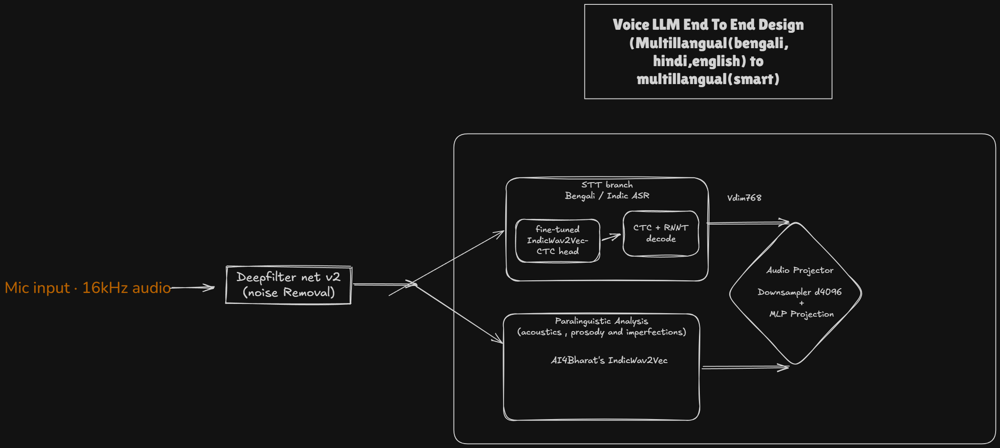

# 🎙️ VoiceLLM: End-to-End Multimodal Voice LLM

<p align="center">
  
</p>

VoiceLLM is a state-of-the-art research and execution framework for **Multilingual Speech-to-Speech & Voice Language Models** (supporting Bengali, Hindi, and English).

---

## 🌟 Architectural Pipeline

1. **Front-End Audio Enhancement**:
   - 16 kHz microphone input passed through **DeepFilterNet v2** for real-time background noise removal and speech enhancement.

2. **Dual-Stream Audio Perception**:
   - **Semantic / STT Branch**: Fine-tuned IndicWav2Vec / IndicConformer with CTC/RNNT decode, producing semantic latents ($V_{\text{dim}} = 768$) and transcription tokens.
   - **Paralinguistic Branch**: IndicWav2Vec acoustic representation modeling acoustics, prosody, emotional inflections, and speech imperfections.

3. **Audio Projector & Downsampler**:
   - Fuses semantic latents and paralinguistic acoustic embeddings.
   - Temporal downsampling to optimize sequence length.
   - Multi-Layer Perceptron (MLP) projection to the LLM hidden dimension ($d = 4096$).

4. **Transformer Backbone & Speech Synthesis**:
   - Autoregressive decoder backbone with RoPE, SwiGLU, and RMSNorm.
   - Neural audio codec token generation for natural speech output.

---

## 📁 Repository Structure

```
VoiceLLM/
├── assets/                     # Audio test samples & project media
│   └── audio/
├── configs/                    # Model, encoder, and training YAML configs
├── notebooks/                  # Interactive experimentation & validation notebooks
├── public/                     # Documentation diagrams & static assets
│   └── stt.png
├── tests/                      # Unit and integration test suite
├── voicellm/                   # Core Python package
│   ├── audio/                  # Audio I/O and DeepFilterNet denoiser
│   │   └── denoiser/
│   ├── models/                 # Neural architectures
│   │   ├── backbones/          # LLM decoders (RoPE, SwiGLU, RMSNorm)
│   │   ├── encoders/           # Dual-stream STT & Paralinguistic encoders
│   │   └── projectors/         # Temporal downsampler & MLP projector
│   ├── data/                   # Dataset streaming, collators, and tokenizers
│   └── inference/              # Real-time microphone and inference pipelines
├── pyproject.toml              # Build system & package specifications
├── requirements.txt            # Dependency manifest
└── README.md
```

---

## 🚀 Quickstart

```bash
# Clone & install dependencies
pip install -r requirements.txt
pip install -e .
```
