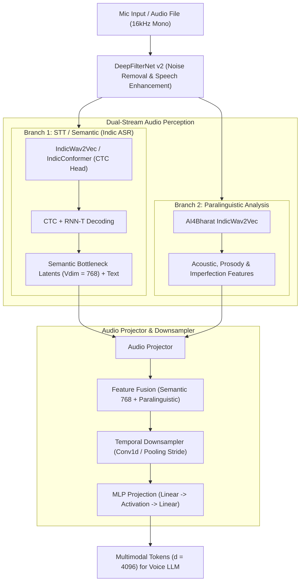

# 📋 Samvyas: STT & Audio Perception Implementation Plan

This document defines the architectural blueprint and phased implementation plan for the **Speech-to-Text (STT) and Dual-Stream Audio Perception System** illustrated in [`public/stt.png`](./public/stt.png).

---

## 🎯 Architectural Overview

The front-end pipeline transforms raw 16 kHz microphone audio into enhanced speech, extracts dual-stream semantic and paralinguistic representations, and downsamples/projects them into the 4096-dimensional multimodal LLM latent space.

---

## 🚀 Phased Implementation Roadmap

### Phase 1: Package Foundation & Audio Enhancement (DeepFilterNet v2)
- **Goal:** Create the `samvyas` package structure and implement real-time 16kHz audio I/O with DeepFilterNet v2 noise removal.
- **Files to create:**
  - `samvyas/__init__.py`: Top-level package definitions.
  - `samvyas/audio/__init__.py`
  - `samvyas/audio/io.py`: Robust audio loader supporting `.wav`, `.m4a`, `.mp3` with automatic 16kHz mono normalization and floating-point scaling.
  - `samvyas/audio/denoiser/base.py`: Abstract interface for audio enhancement (`enhance(waveform) -> enhanced_waveform`).
  - `samvyas/audio/denoiser/deepfilter.py`: Wrapper around **DeepFilterNet v2** (`df.enhance`) with automatic device selection and chunked streaming support.
- **Verification:**
  - `tests/test_audio_io.py`: Test audio normalization on `assets/audio/audio_for_inference.wav`.
  - `tests/test_denoiser.py`: Test DeepFilterNet v2 denoising on noisy and clean speech.

---

### Phase 2: Branch 1 - STT & Semantic ASR Encoder (Indic ASR)
- **Goal:** Implement the semantic ASR branch supporting Bengali, Hindi, and English with fine-tuned IndicWav2Vec / IndicConformer.
- **Files to create:**
  - `samvyas/models/__init__.py`
  - `samvyas/models/encoders/__init__.py`
  - `samvyas/models/encoders/base.py`: Abstract `BaseAudioEncoder` defining signature `forward(waveform) -> AudioEncoderOutput`.
  - `samvyas/models/encoders/indic_asr.py`:
    - Loads pre-trained / fine-tuned Indic ASR checkpoint dynamically from HuggingFace Hub.
    - Exposes intermediate **768-dimensional semantic bottleneck features** `(B, T_frames, 768)`.
    - Implements CTC greedy & beam decoding for Bengali/Hindi/English transcriptions.
    - Supports optional RNN-T joint decoder pass.
- **Verification:**
  - `tests/test_indic_asr.py`: Test feature extraction shape `(B, T_frames, 768)` and text transcription using `assets/audio/vocaltest.m4a`.

---

### Phase 3: Branch 2 - Paralinguistic Analysis Encoder
- **Goal:** Implement the acoustic and prosodic branch capturing non-verbal voice cues (cadence, pitch, emotion, hesitation, breathing, imperfections).
- **Files to create:**
  - `samvyas/models/encoders/paralinguistic.py`:
    - Wraps `ai4bharat/indicwav2vec` (or wav2vec2-based acoustic feature extractor).
    - Extracts dense acoustic frame-level representations `(B, T_frames, D_para)`.
    - Computes acoustic statistics (F0/pitch contour, energy, pauses) as auxiliary conditioning signals.
- **Verification:**
  - `tests/test_paralinguistic.py`: Verify output dimensions and temporal alignment with the STT branch.

---

### Phase 4: Audio Projector & Temporal Downsampler
- **Goal:** Fuse dual-stream representations, compress temporal length, and project into the LLM embedding space ($d = 4096$).
- **Files to create:**
  - `samvyas/models/projectors/__init__.py`
  - `samvyas/models/projectors/downsampler.py`:
    - Strided 1D convolution stack (e.g. stride 2 or 4) with GELU/SwiGLU activations and residual skip connections.
    - Reduces audio frame rate to match LLM context capacity.
  - `samvyas/models/projectors/mlp.py`:
    - Two-layer MLP with LayerNorm/RMSNorm projecting fused & downsampled features to $d_{\text{model}} = 4096$.
  - `samvyas/models/projectors/audio_projector.py`:
    - Unified module combining Fusion + Downsampling + MLP Projection.
- **Verification:**
  - `tests/test_projector.py`: Feed `(B, T, 768)` and `(B, T, D_para)`, verify output is `(B, T // stride, 4096)`.

---

### Phase 5: End-to-End Orchestrator & Streaming Interface
- **Goal:** Unify Frontend + Dual Encoders + Projector into a single clean API with live microphone streaming capabilities.
- **Files to create:**
  - `samvyas/models/stt_frontend.py`:
    - Master pipeline class: `STTPerceptionPipeline(waveform) -> { "projected_tokens": Tensor, "semantic_latents": Tensor, "paralinguistics": Tensor, "transcription": str }`.
  - `samvyas/inference/stream.py`:
    - Real-time 16kHz microphone capture and circular buffer streaming.
  - `scripts/run_mic_stt.py`:
    - CLI tool to capture audio from mic, denoise, transcribe, and print projected embedding stats.
- **Verification:**
  - `tests/test_pipeline.py`: Full end-to-end forward test from raw audio to $d=4096$ tokens.

---

## 📊 Summary of Module Tensor Shapes

| Stage | Input Shape | Output Shape | Notes |
|---|---|---|---|
| **DeepFilterNet v2** | `(B, T_audio)` | `(B, T_audio)` | 16 kHz clean speech |
| **Branch 1: Indic ASR** | `(B, T_audio)` | `(B, T_frames, 768)` | Phonetic / Semantic latents + text |
| **Branch 2: Paralinguistics**| `(B, T_audio)` | `(B, T_frames, D_para)`| Acoustic nuance & prosody |
| **Fusion** | `(B, T_frames, 768)`, `(B, T_frames, D_para)` | `(B, T_frames, 768 + D_para)` | Aligned frame concatenation |
| **Downsampler** | `(B, T_frames, 768 + D_para)` | `(B, T_frames // stride, D_proj)` | e.g., stride = 2 or 4 |
| **MLP Projector** | `(B, T_down, D_proj)` | `(B, T_down, 4096)` | Projected to Voice LLM embedding space |
